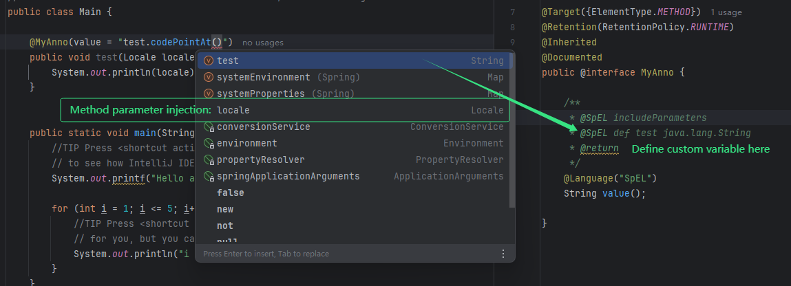

# spel-type-helper



<!-- Plugin description -->

Inject custom variable to your SpEL context.

# Quick Start

You have to modify your Java doc to enable our SpEL support.

## Inject Method Parameters

Just add `@SpEL includeParameters` to your Java doc:

```java
public @interface MyAnno {

    /**
     * @SpEL includeParameters
     */
    @Language("SpEL")
    String value();
}
```

## Define Custom Variable

You can define addition variable to the SpEL context, use `@SpEL def <name> <class>`:

```java
public @interface MyAnno {

    /**
     * @SpEL def test java.lang.String
     */
    @Language("SpEL")
    String value();
}
```

> [!IMPORTANT]  
> The class must be qualified name, such as `java.lang.String`, not `String`.

<!-- Plugin description end -->